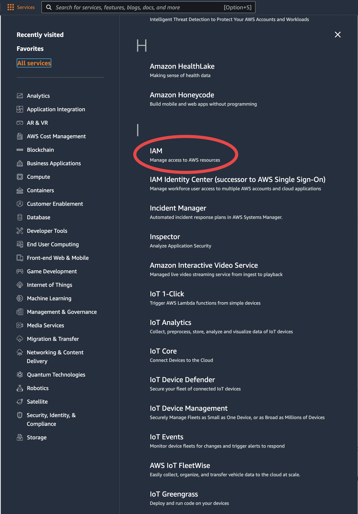

# AWS IAM (Identity and Access Management)

### Table of Contents
- [Root User](#root-user)
- [Users and User Groups](#users-and-user-groups)
  - [Users](#users)
  - [User Groups](#user-groups)
- [Roles and Polices](#roles-and-policies)
  - [Roles](#roles)
  - [Policies](#polices)
- [User Permissions](#user-permissions) 

## Root User
Creating an AWS account successfully, we have an account called **root user** which is signed in with email and password created for the account.

**Note:** we should not use the root user for our everyday tasks, even the administrative ones. Instead, We will create an [IAM user](#users), and use it to do the tasks.

We can press IAM in Services, then access to IAM dashboard.

## Users and User Groups

  #### Users

  An IAM user is an entity that is created and granted permission by the root user. We can sign in to AWS to do tasks that need AWS services by User which is an identity with long-term credentials, including username, password, and access key,...

  #### User Groups

  This is a group having many IAM users, and a user can also belong to many groups. We can use the user groups specify to permissions for a collection of users instead of updating each user.

## Roles and Policies

  #### Roles
  A set of permissions that you can use to access the AWS resources you need. Maybe, an IAM role is similar to a user, but a role does not have credentials that we can switch roles after signing in with our user. A role can be understood as an account with temporary credentials to handle the different tasks with different roles.

  #### Polices
  

## User Permissions
