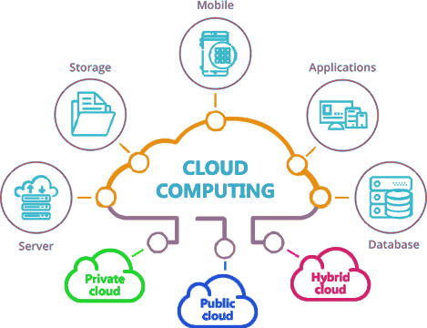

# Getting Started with AWS

### Table of Contents
1. What is Cloud Computing?
2. What is AWS?

## Introduction
AWS stands for Amazon Web Services, it needs no formal introduction, given its immense popularity. The leading cloud provider in the marketplace is Amazon Web Services. It provides over 170 AWS services to the developers so they can access them from anywhere at the time of need.

AWS has customers in over 190 countries worldwide, including 5000 ed-tech institutions and 2000 government organizations. Many companies like ESPN, Adobe, Twitter, Netflix, Facebook, BBC, etc., use AWS services.

For example, Adobe creates and updates software without depending upon the IT teams. It uses its services by offering multi-terabyte operating environments for its clients. By deploying its services with Amazon services, Adobe integrated and operated its software in a simple manner.

Now, before getting started with what is AWS, let us first give you a brief description of what cloud computing is.

## What is Cloud Computing?
Cloud computing is the delivery of online services (such as servers, databases, software) to users. With the help of cloud computing, storing data on local machines is not required. It helps you access data from a remote server. Moreover, it is also used to store and access data from anywhere across the world.

## What is AWS?
Amazon web service is an online platform that provides scalable and cost-effective cloud computing solutions.

AWS is a broadly adopted cloud platform that offers several on-demand operations like compute power, database storage, content delivery, etc., to help corporates scale and grow. Providing a pay-as-you-go system removes the requirement for capital to be provided upfront. It helps in controlling, auditing, and managing identity, configuration, and usage.

Several companies around the world use AWS’s services, such as Docker, Kellog’s, NASA, McDonald’s, BMW, Harvard Medical School, and Adobe, to name a few.

## AWS Services
Amazon has many services for cloud applications. Here are some popular ones:

- Compute service
- Storage
- Database
- Networking and delivery of content
- Security tools
- Developer tools
- Management tools

Today we will dig down about AWS Compute service and EC2.

### Compute Service
These services help developers build, deploy, and scale an application in the cloud platform.

### AWS EC2
EC2 stands for Elastic Compute Cloud. It is the core compute component in the infra. This is nothing but a simple server where applications can be hosted. There are multiple types of EC2s available from AWS, each type serving a slightly different purpose. AWS uses the word EC2 Instance referring to a server.

It offers various instance types to developers so that they can choose required resources such as CPU, memory, storage, and networking capacity based on their application requirements.

There are some related knowledge you should know when exploring an EC2 instance:

##### Instance type
This item is to determine the hardware configuration for our server, about CPU, Ram, just choose `Free tier`.
##### Key pair
This part will generate a private key that will allow you to SSH into our server to execute command line commands. You must have knowledge of Linux cmd. Avoid public to outsiders because if others have it, they will be able to access your server

##### Security Groups
Security groups are a set of firewall rules that control traffic to and from your instance. Incoming rules control incoming traffic from your instance and outgoing rules control outgoing traffic from your instance. You can specify one or more security groups for your instance. If you specify multiple security groups, all rules will be evaluated to control incoming and outgoing traffic. If no value is specified, the value of the source template will still be used. If a template value is not specified then the default API value will be used.

In a nutshell, it's like a Windows firewall that allows you to open ports, allowing outsiders to access any server application.

##### Storage
This section specifies archiving options for the instance. allocate storage for our instances. Here AWS EC2 allows up to 30GB for free.
