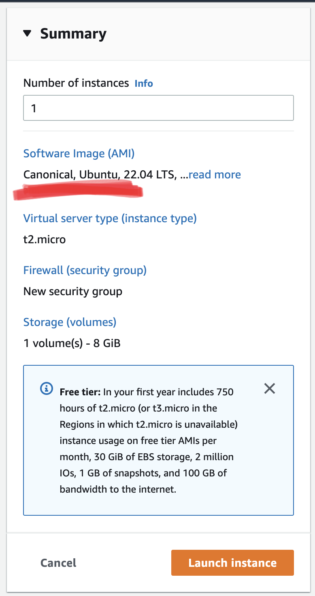

# Learn AWS EC2
Deploy a simple NodeJS to AWS EC2

## What is EC2?
[EC2](https://docs.aws.amazon.com/AWSEC2/latest/UserGuide/concepts.html) (Elastic  Compute Cloud) is an environment helping your frontend, backend applications can go live in `production` or `staging`.

## What is EC2 instance?
[EC2 instance](https://docs.aws.amazon.com/AWSEC2/latest/UserGuide/LaunchingAndUsingInstances.html) is a virtual server in the AWS Cloud. We have many ways to create an instance. In the guide, I will create it via `Launch instance` in `EC2 Dashboard`.

## Create an EC2 instance
**I. Have an AWS account and access to `EC2 Dashboard`.**


**II. Create AWS EC2**
1. Press `Launch Instance`

2. Fill in name of instance


3. Select OS of the virtual server. I often use Ubuntu here.


4. Generate **key pair**. If you want to ssh to the virtual, you must have it.

Press `Create new key pair`

Fill in `Key pair name`, then press `Create key pair` and **save** it in your laptop.

5. Press `Launch Instance`. The instance is created successfully.


**III. SSH to virtual**
If you use iTerm2 on Apple Silicon chip, I think you can met the terminal is very slow and lag. So you can try using [WARP](https://www.warp.dev/) instead.
You copy `Public IPv4 DNS` having in `Instance Information`. In current folder, you paste the `.pem` file to here. Open the terminal and type
```bash
$ ssh -i <file-name>.pem <publict-ipv4-dns>
```
Otherwise, you will get Error: Unprotected private key file
```bash
$ chmod 400 <file-name>.pem
```


**IV. Run server in EC2**
1. Set up env and others
- Install [nvm](https://github.com/nvm-sh/nvm)
```bash
$ curl -o- https://raw.githubusercontent.com/nvm-sh/nvm/v0.39.1/install.sh | bash
$ nvm --version
```

- Install node 16
```bash
$ nvm install 16
$ node -v
```

- Install [yarn](https://classic.yarnpkg.com/lang/en/docs/install/#mac-stable) if the repo using yarn
```bash
$ npm i -g yarn
```

- Install [pm2](https://pm2.keymetrics.io/)
```bash
$ npm i -g pm2
```

2. Clone Git repository
- Generate SSH key and create new SSH key on Github
```bash
$ ssh-keygen -t rsa -b 4096
```

- Clone source code
```bash
$ git clone git@github.com:<repo-name>.git
```
You can try cloning my demo here: https://github.com/imnhsang/simple-nodejs-deploy-ec2 

3. Run Node server
If you cloned my demo, you can try commands bellow.

- **cd to demo folder**
- Install dependencies
```bash
$ yarn
```

- Build server
```bash
$ yarn build
```

- Use `pm2` to start Node one.
```bash
$ pm2 start dist/server.js
```

- Check log of server
```bash
$ pm2 log
```

Now, the server is running on port **8080** and the url is `<public-ipv4-address>:8080`.
But I think you will get the error being `too long to respond`. You must update `inbound rules` below.


**After that, Congrats! The Node server is being run now.**

**Please do not share any AWS information on the Internet.**
