# Introduction to Amazon EC2

## Launch an EC2 instance
- After sign to AWS console, we search EC2 services and click on that


- Find the **Launch instance** button
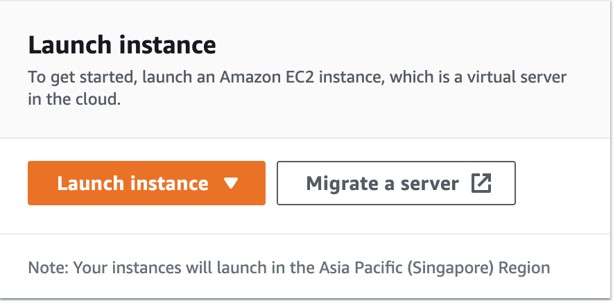

- First of all, we add **tags and choose an OS** for our instance. We have Amazon Linux, macOS, Ubuntu, Window,... We have some difference setup steps for each OS, so you can choose an OS that you familar to or just follow this practic. In this example, I use Ubuntu
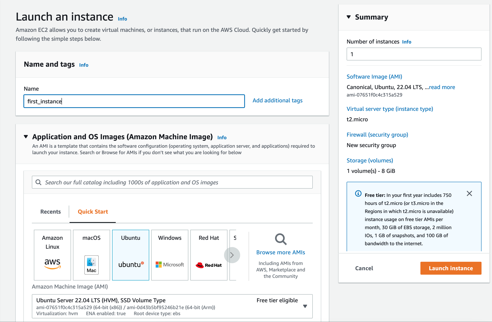

- **Instance type**: select an instance type that has CPU and memory suitable for your application. In this example, I use **t2.micro**
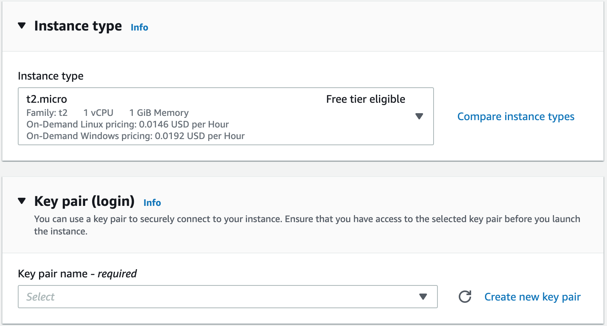

- Next, we need a **key pair** - (This key pair will be used to SSH to our instance - we talk about it later) - I will generate a new key pair
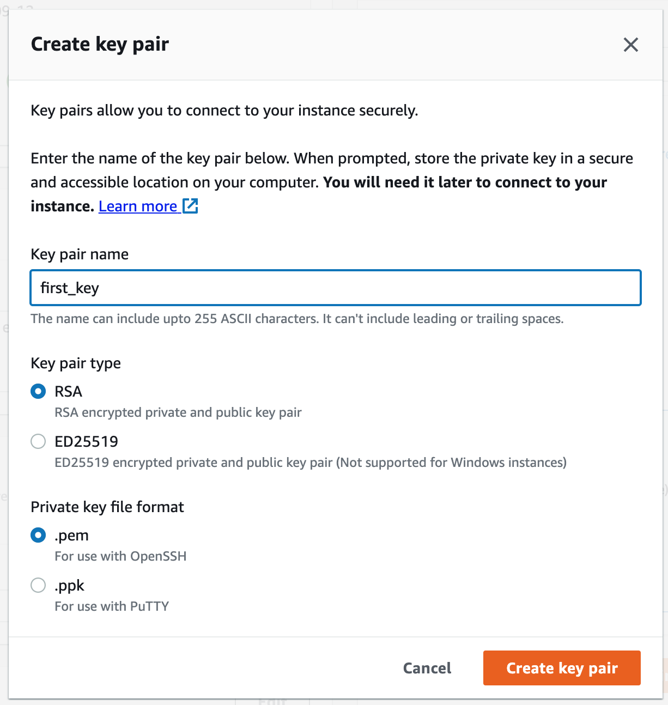
- When you click **Create key pair**, a key file (*.pem or *.cer) will be downloaded. You have to save and remember it for use later.

- **Network setting**: we will create a new security group and just allow SSH connection from our IP
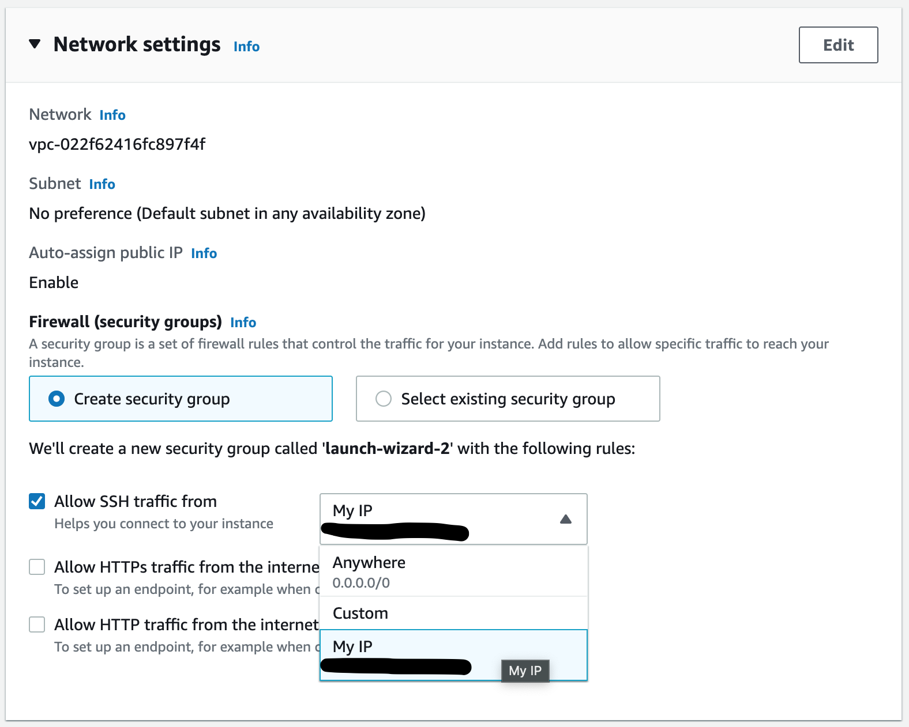
- **Storage** and **Advance Setting** we use default options
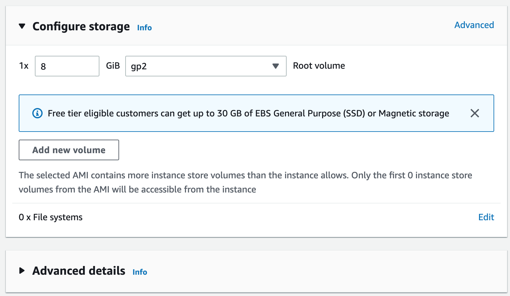
- Finally, click **Launch Instance** and waiting ...
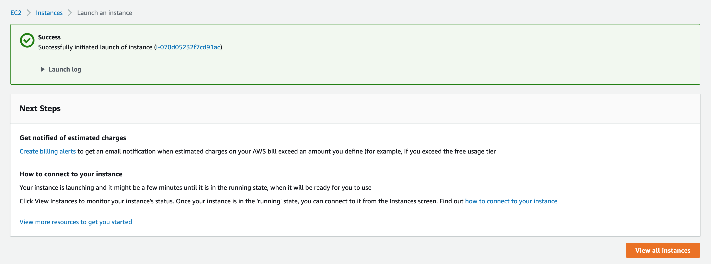
- Back to the EC2 dashboard, we can see an instance is being initialized. And We waiting till it finished


## SSH to instance & Create a simple Sinatra app

### SSH to instance
- SSH is a network protocol, you can read more about it [here](https://www.techtarget.com/searchsecurity/definition/Secure-Shell)
- AWS EC2 allow us connect to our instance by SSH connection. We need 3 things to SSH to our instance: a **key file**, **instance identification** and an **username** in that instance.
  - **Key file**: the file that we downloaded when we launch EC2 instance. We need limit permitions for key file before using it
    > sudo chmod 400 first_key.cer
  - **Instance identification**: can be public IPv4 address, IPv6 address or public DNS name. We can find them in instance summary page.
  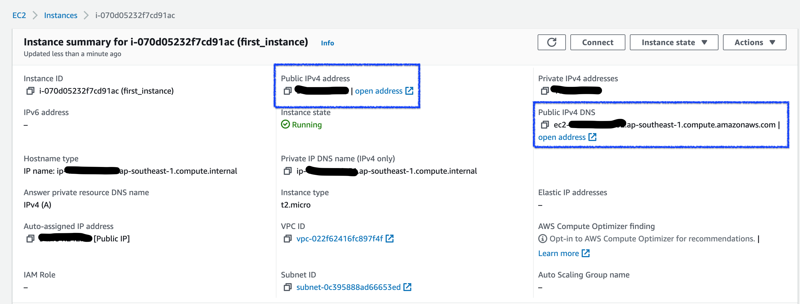
  - **Username**: By default, if you select Amazon Linux, username is **ec2-user**. And username is **ubuntu** for Ubuntu OS
- Syntax for SSH:
  > ssh -i key_file_name user_name@instance_identification
- For this practice, I save my key is **first_key.cer**, I chose Ubuntu OS for instance
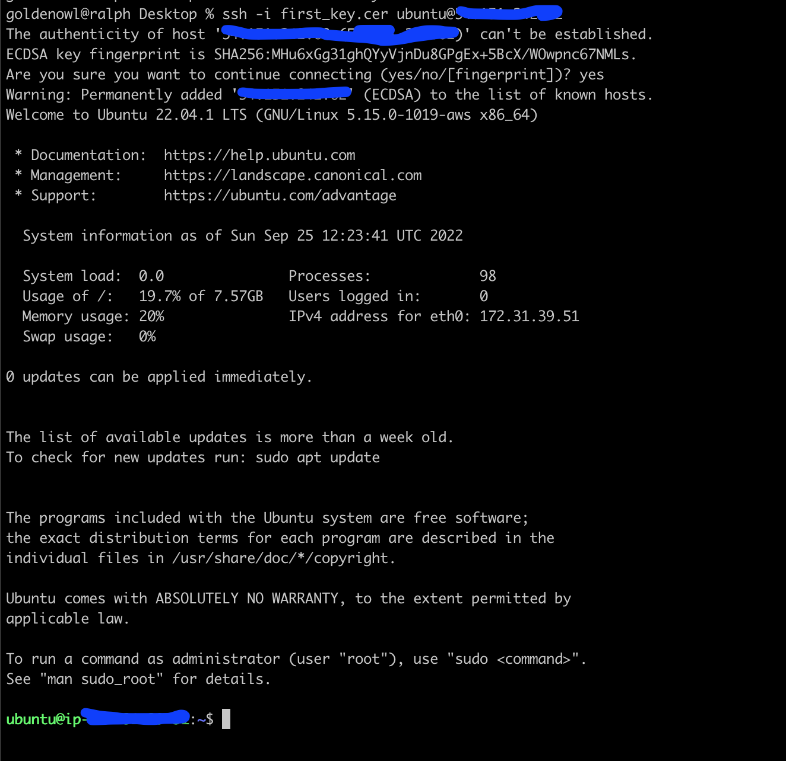

### Create a simple Sinatra app
- After SSH to instance, we will install packages for create a Sinatra app
```
sudo apt install ruby-full
sudo gem install sinatra
```
- Create a new file **app.rb**
```
vim app.rb
```
and paste below content to that file
```
 require 'rubygems'
 require 'sinatra'
 set :bind, '0.0.0.0'
 set :port, 80

 get '/' do
   'Hello World'
 end
```
- Now, we start this Sinatra app
```
sudo ruby app.rb
```
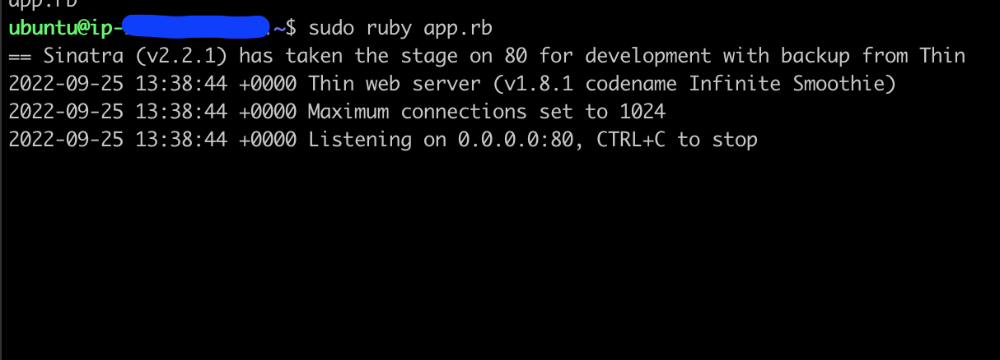
## Config for users access to our app
We have a server (EC2 instance) and a Ruby application run on it. Now we need to config Security Group to allow users access to our app.

> **Security group** controls the traffic that is allowed to reach (inbound rules) and leave (outbound rules) the resources


In EC2 summary page, on Security tab, click on **Security Group name**


Click on **Edit Inbound Rules**
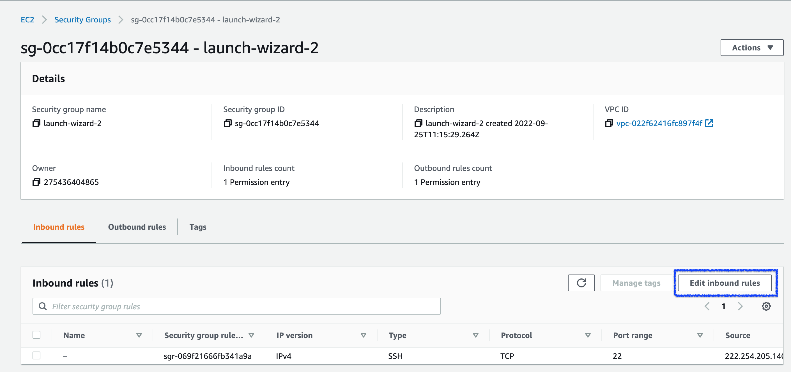

Add a new rule with type **HTTP** (protocol will be default TCP, port default is 80) and **Source** we select **Anywhere IPv4**.
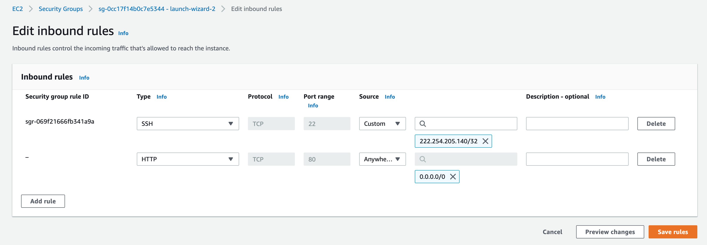

Open our website from EC2 summary page, change type to **HTTP** and we can see our **Hello world** page
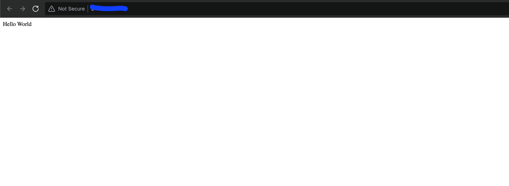
