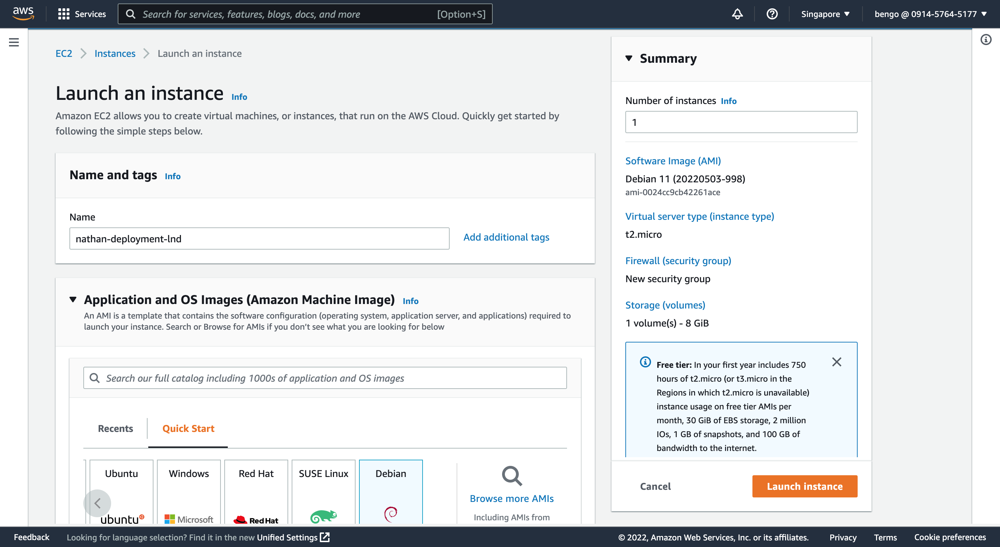
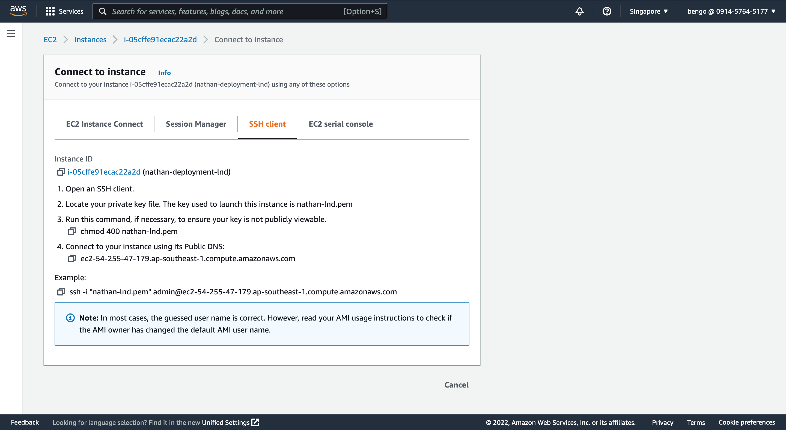

# Deploy a simple application with AWS

### Step 1: Create an EC2 instance
Click on `launch instances` and fill out all the required fields. In this tutorial we will launch a `t2.micro` instance, using Debian AMI.


In `Key pair` section, you can create a new key pair an store in your local machine. If you have already had once, select it on the dropdown to re-use the old key pair. Everything else you can left it as default and click `Launch instance`

### Step 2: Connect to the instance
Go to the detail page of your instance and click on `Action` -> `Connect`. A small container will pop up with guide you how to connect step by step.


### Step 3: Install software
#### Install Ruby and needed packages
Execute the following commands to update your system’s package database and all installed packages:
```
apt-get update
apt-get upgrade
```

Issue the following command to install Ruby dependencies for Sinatra.
```
apt-get install wget build-essential ruby1.8 ruby1.8-dev irb1.8 rdoc1.8 zlib1g-dev libopenssl-ruby1.8 rubygems1.8 libopenssl-ruby libzlib-ruby libssl-dev libpcre3-dev  libcurl4-openssl-dev
```

Create symbolic links to the installed version of Ruby:
```
ln -s /usr/bin/ruby1.8 /usr/bin/ruby
ln -s /usr/bin/irb1.8 /usr/bin/irb
```

#### Install Webserver
In this tutorial, we'll be using NGINX as our webserver to receive HTTP requests. Those requests will then be handed over to Puma which will run our Sinatra app.
```
gem install puma
```

We'll start NGINX by executing this command
```
sudo service nginx start
```

You can check and make sure NGINX is running by visiting your server's public IP address in your browser and you should be greeted with the "Welcome to NGINX" message.

Next we're going to remove this default NGINX server and add one for our application instead.
```
sudo rm /etc/nginx/sites-enabled/default

# If you want to use the Nano for editing
sudo nano /etc/nginx/sites-enabled/myapp
# If you want to use the Vim for editing
sudo vim /etc/nginx/sites-enabled/myapp
```

Change `myapp` to the name of your app.
We want the contents of our NGINX site to look like the following.
```
upstream sinatra {
    server unix:/PATH/TO/YOUR/APP/tmp/puma.sock;
}

server {
    listen 80;
    root /PATH/TO/YOUR/APP/public;
    server_name YOUR_DOMIAN.COM;

    location / {
        try_files $uri $uri/index.html @puma;
    }

    location @puma {
        proxy_set_header X-Forwarded-For $proxy_add_x_forwarded_for;
        proxy_set_header Host $http_host;
        proxy_redirect off;
        proxy_pass http://sinatra;
  }
}
```
Obviously replace `PATH/TO/YOUR/APP` with correct path and `YOUR_DOMIAN.COM` with your domain, then save it.

### Step 4: Create a Basic Sinatra Application
The following is a very basic Sinatra application, you can find the repository [here](https://github.com/nathan-phan-goldenowl/simple_sinatra_app).

Create a directory for your app, maybe named `my_app`. Now the app.rb file should look like this
```
require 'sinatra'

configure {
  set :server, :puma
}

class App < Sinatra::Base
  get '/' do
    "Hello and Goodbye"
  end

  get '/hi' do
    "Hello World! :)"
  end

  get '/bye' do
    "Goodbye World! :("
  end
end
```
Nothing fancy. Just some simple routes to prove our app is working.

Now we need a rackup file. Save below content in a `config.ru` file.
```
require_relative 'app'

run App
```

We also need a `Gemfile` to declare required gems
```
source 'https://rubygems.org'
git_source(:github) { |repo| "https://github.com/#{repo}.git" }

# We use puma old version (< 5) here for daemonize option
gem 'puma',  '< 5'
gem "sinatra"
```

Finally our Puma config file
```
root = "#{Dir.getwd}"

bind "unix://#{root}/tmp/puma.sock"
pidfile "#{root}/tmp/pids/puma.pid"
rackup "#{root}/config.ru"
state_path "#{root}/tmp/pids/puma.state"

threads 4, 8

daemonize true
activate_control_app
```

Save it in `config/puma.rb` file. Then we need some supporting directories.
```
mkdir -p tmp/pids public
```

Additionally, we need a file to contain all of our building & deploying scripts
```
bundle install --path vendor/bundle
mkdir -p tmp/pids public
bundle exec puma --config config/puma.rb
```
Put it in `commands.sh` file.

### Step 5: Make it alive
After having everything ready, we will make our application alive by running
```
sh commands.sh
```

Reload NGINX to load the new server files. Visit your URL. Our Sinatra app is live. 🎉🎉🎉
```
sudo service nginx reload
```
If you used the example application above, visit `YOUR_DOMIAN.COM/hi`, and `YOUR_DOMIAN.COM/bye` to view different messages (Don't forget to replace `YOUR_DOMIAN.COM` with your domain).
