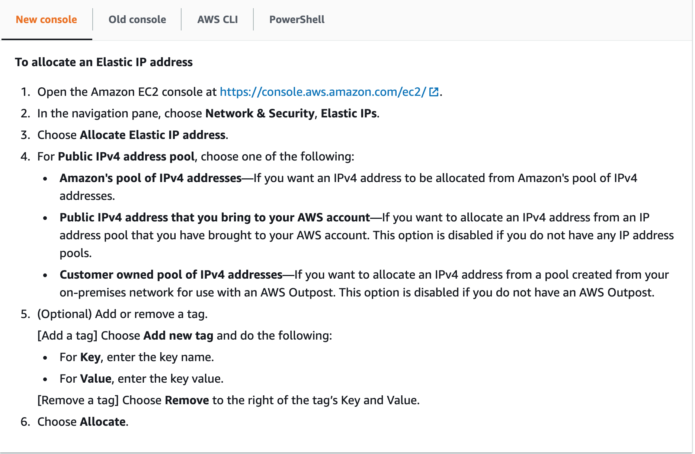
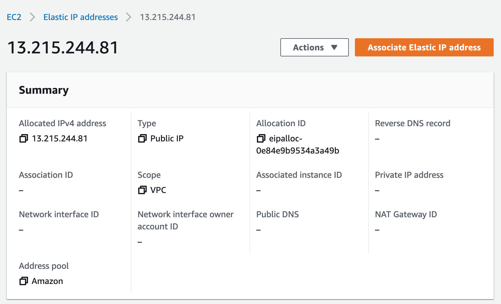
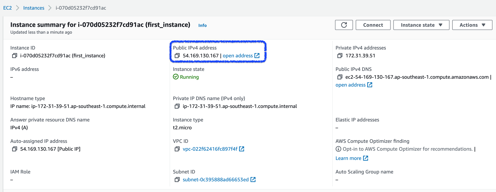
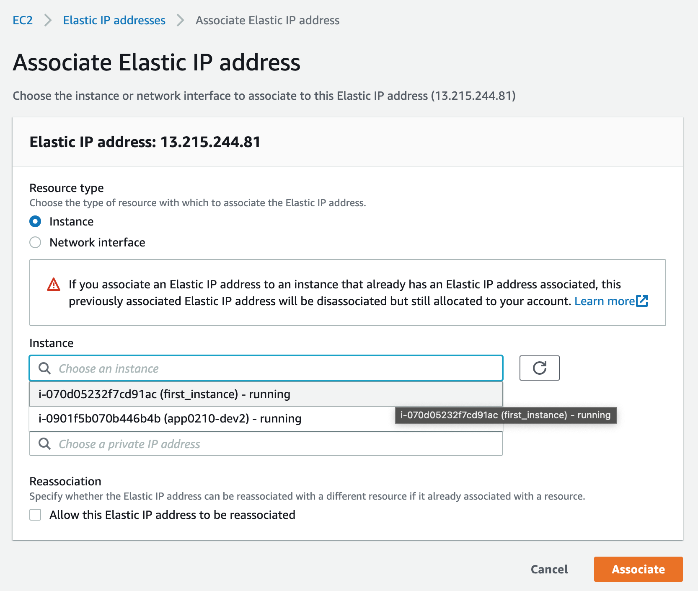

# Introduction to AWS Elastic IPs

## What is Elastic IPs
Each (AWS EC2) instance can be assigned a **public IPv4 address** for communicates to public internet. But when an instance **start/stop/reboot/hibernate**, it's **public IP will be changed**. This behavior leads to some difficulties:
- SSH to instance with new public IP.
- Deployment with automation tool like Capitrano: Capitrano behind the scene just running SSH commands on remote servers (our instance), so you need to update the new IP of instance in config file.
- Public and private DNS names are constructed based upon an instance's public and private IP addresses. So, **if an instance's public IP address changes, the public DNS name will also change accordingly**.
- And all the other difficulties because of public IP change.

**Elastic IP address** is a static IPv4 address, when it is allocated to your AWS account and is your until you release it. It means when an instance was associated with an Elastic IP, it will never change until you change it yourself.

## Work with Elastic IP addresses
Assumed that you had an EC2 instance. And we will allocate and associate an EIP with that instance.

### Allocate an Elastic IP address

<br/>
You can see an Elastic IP was allocated like the image below

<br/>
Select **Action --> View detail** to view that Elastic IP detail


### Associate an Elastic IP with an instance
This is my instance. Let's apply Elastic IP for it!

<br/>
In **Action** -> **Associate Elastic IP address**
Select **Resource type** is **Instance**, the instance name that you need to association to. And click **Associate**

Open EC2 instance detail again and you can see it's public IP address is the Elastic IP address now


### Disassociation an Elastic IP
For some reasons, you want to disassociate Elastic IP from an instance (or network interface). To do that, you just select EIP and choose **Disassociate Elastic IP address** action

And the (running) EC2 instance will be assigned an another public IP address


### Release an Elastic IP
If an Elastic IP isn't associated to any AWS resources and you no longer need it, you can release it.
Notes: When an EIP was released, you can't recover that EIP if it has been allocated to another AWS account
To release an Elastic IP, select **Release Elastic IP address** action.

### Recover an Elastic IP
If Elastic IP address is still available (it hasn't been allocated to any AWS account) and your Elastic IP address limit has not been reached yet, you can recover it.
```
aws ec2 allocate-address --domain vpc --address 13.215.244.81
```

Check at Elastic IP tab again, you can see your Elastic IP is back.

## Use reverse DNS for email applications
```
Many email servers will reject messages from any server that does not support reverse (DNS) lookups.
```
You can read more about Reverse DNS [here](https://www.cloudflare.com/learning/dns/glossary/reverse-dns/).
So, if you send email to third parties from an instance, you should assign static reverse DNS records to the Elastic IP addresses that you use to send email

### Create a reverse DNS record

### Remove a reverse DNS record


## Elastic IP address pricing
AWS imposes a small hourly charge if an Elastic IP address isn't be used (not associated, associated with a stopped instance or an unattached network interface). Each running instance has a free EIP and will be charged for any additional EIP associated with the instance. 


## Some notes for Elastic IPs
- An Elastic IP address is for use in a specific Region only.
- AWS accounts are limited to 5 Elastic IP addresses for each Region. If you need more than five Elastic IP addresses, you must [sumit a request](http://aws.amazon.com/contact-us/eip_limit_request/) to AWS.
- An Elastic IP address comes from Amazon's pool of IPv4 addresses, or from a custom IPv4 address pool that you have brought to your AWS account.
- When you allocate an Elastic IP address from an IP address pool that you have brought to your AWS account, it does not count toward your Elastic IP address limits.
