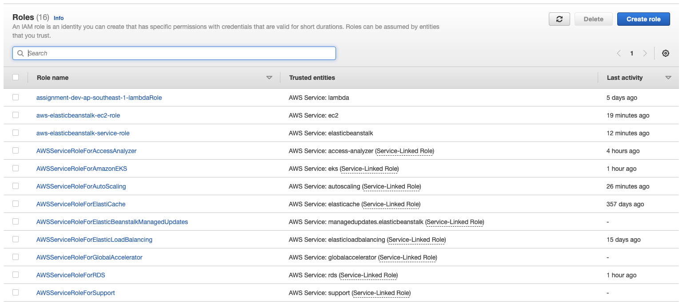

# AWS IAM (Identity and Access Management)

### Table of Contents

- [Root User](#root-user)
- [Users and User Groups](#users-and-user-groups)
  - [Users](#users)
  - [User Groups](#user-groups)
- [Roles and Polices](#roles-and-policies)
  - [Roles](#roles)
  - [Policies](#polices)
    - [Identity-based policies](#identity-based-policies)
    - [Resource-based policies](#resource-based-policies)
    - [Permissions boundaries](#permissions-boundaries)
    - [Organizations SCPs](#organizations-scps)
    - [Access control lists (ACLs)](#access-control-lists-acls)
    - [Session policies](#session-policies)

## Root User

Creating an AWS account successfully, we have an account called **root user** which is signed in with email and password created for the account. [Read more](https://docs.aws.amazon.com/IAM/latest/UserGuide/id_root-user.html)

**Note:** we should not use the root user for our everyday tasks, even the administrative ones. Instead, We will create an [IAM user](#users), and use it to do the tasks.

We can press IAM in Services, then access to IAM dashboard.

## Users and User Groups

#### Users

An IAM user is an entity that is created and granted permission by the root user. We can sign in to AWS to do tasks that need AWS services by User which is an identity with long-term credentials, including username, password, and access key,...

[Read more](https://docs.aws.amazon.com/IAM/latest/UserGuide/id_users.html)

#### User Groups

This is a group having many IAM users, and a user can also belong to many groups. We can use the user groups specify to permissions for a collection of users instead of updating each user.

[Read more](https://docs.aws.amazon.com/IAM/latest/UserGuide/id_groups.html)

## Roles and Policies

#### Roles

A set of permissions that you can use to access the AWS resources you need. Maybe, an IAM role is similar to a user, but a role does not have credentials that we can switch roles after signing in with our user. A role can be understood as an account with temporary credentials to handle the different tasks with different roles.

[Read more](https://docs.aws.amazon.com/IAM/latest/UserGuide/id_roles.html)

#### Policies

Before reading, we should know what is **Principal**? It can be an user or an application which sends requests to action on a resource.

The policy is created or specified permissions to access AWS Resources. It is attached to IAM identities (Users, User Groups, and Roles). AWS provides us with 6 types of the policy below.

##### Identity-based policies

These policies - JSON policy permission which are attached to Users, User Groups, and Roles in IAM, specify actions allowed or not allowed to access. For example, a user is allowed to create an EC2 instance but not allowed to stop the instance. And the policies include **Managed Policies**, and **Inline Policies**.

- Managed Policies: standalone policies you can use for multiple identities and divided into 2 types below.

  - AWS managed policies: are created and managed by AWS.

  - Customer managed policies: that users create and manage.

- Inline Policies: that users create and specify only a single Identity. If the identity is removed, the policies will be removed.

##### Resource-based policies

These policies - JSON policy permission are inline policies attached to a resource. They specify principals applied policy and use conditions to control access. It allows other principals outside an account to use resources within the account.

##### Permissions boundaries

These policies - JSON policy permission are managed policies used for Users and Roles to limit the maximum permissions of entities that can be performed but not grant permissions.

##### Organizations SCPs

These policies - JSON policy permission use AWS Organizations service control policy (SCP) to define the maximum permissions for account members of an organization or organizational unit (OU). Similarly **Permissions boundaries** does not grant permissions to an entity.

##### Access control lists (ACLs)

ACLs specify the principals of other accounts to control access. They do not use JSON policy structure, and can not use principals in the same account.

##### Session policies

These policies - JSON policy permission are used for temporary credentials or federated users, and grant access to temporary identifiers based on the applied Identity-based policy.

**Note:** If separated by the purpose of use, we will have: Identity-based policy, Session policy, and Resource-based policy are permission policies. With Permission boundaries, Organization SCPs are policies that restrict access.

[Read more](https://docs.aws.amazon.com/IAM/latest/UserGuide/access_policies.html)
